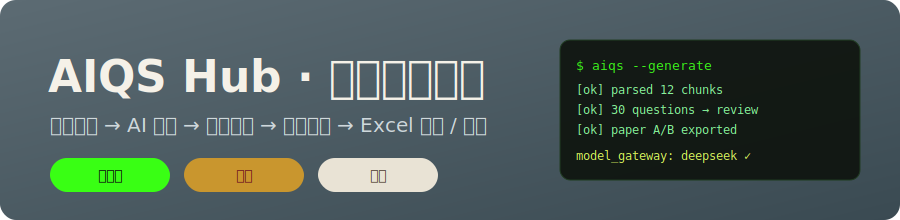
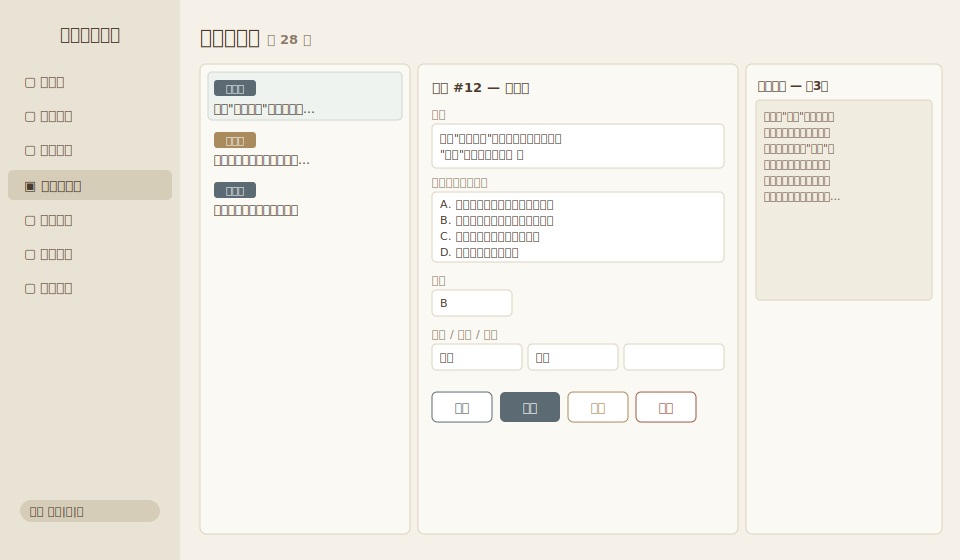
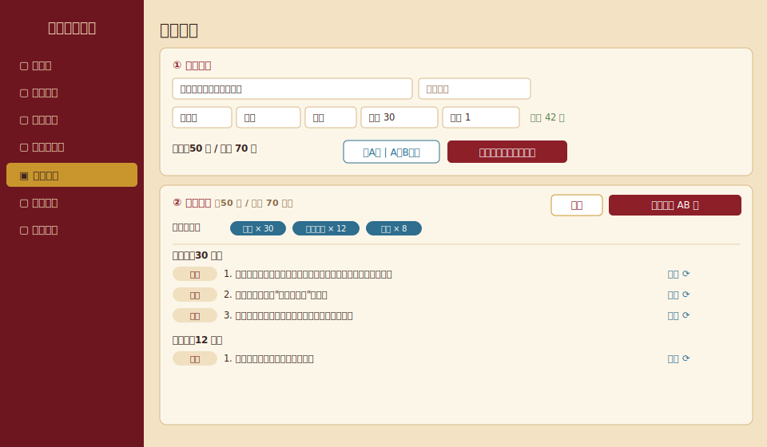
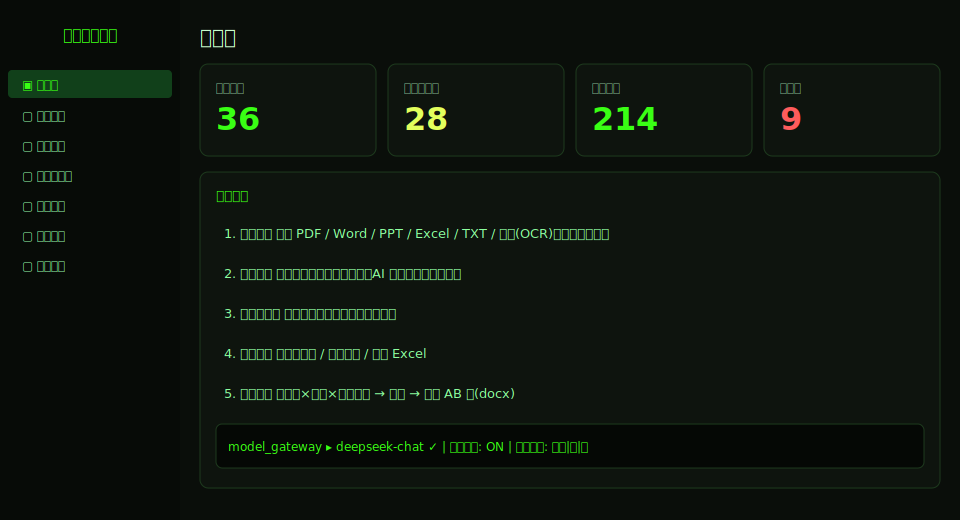

# AIQS Hub — 智能题源中心



[](https://github.com/ghermit263/aiqs-hub/actions/workflows/ci.yml)
[](LICENSE)
[English README](README.en.md)

为现有智能组卷系统提供**题目生产、审核和导出**的前置系统：
上传资料 → 解析切片（保留来源页码）→ AI 出题（待审核）→ 人工审核 → 标准题库 → 导出组卷系统 Excel 模板 / 组卷出 AB 卷。

## 流程演示



## 界面预览

> 各页面在不同主题下的界面预览。

**审核工作台（宋风）** — 左队列 / 中编辑（含分类）/ 右来源原文对照


**试卷组卷（唐风）** — 条件 → 草稿微调（大类分布可视、可换题）→ 预览 / 定稿


**工作台（终端风）** — 三套换肤之一，暗色等宽终端风


## 快速启动（本机开发）

1. 双击 `启动后端.bat`（首次需 `pip install -r backend/requirements.txt -i https://pypi.tuna.tsinghua.edu.cn/simple`）
2. 双击 `启动前端.bat`（首次需在 frontend 下 `npm install --registry=https://registry.npmmirror.com`）
3. 浏览器打开 http://127.0.0.1:5173 ，默认账号 `admin` / `admin123`（**正式使用前请改密码**）

## 内网部署（分享给其它电脑）

推荐**单端口模式**：FastAPI 直接托管打包后的前端，整套只占 8000 一个端口。

1. 在本机双击 `一键部署（单端口）.bat`（会先 `npm run build` 打包前端，再以 `0.0.0.0:8000` 启动）
2. 放行防火墙入站（管理员 PowerShell 跑一次即可）：
   ```powershell
   New-NetFirewallRule -DisplayName "AIQS Hub 8000" -Direction Inbound -Protocol TCP -LocalPort 8000 -Action Allow
   ```
3. 查本机内网 IP：`ipconfig`（找 IPv4，形如 `192.168.x.x`）
4. 其它电脑浏览器打开 `http://<本机IP>:8000` 即可，无需装任何东西

> 改了前端代码后需重新 `npm run build`（或重跑一键部署脚本）才会生效。
> 开发模式下也可让别人访问 `http://<本机IP>:5173`（Vite 需 `--host`），但单端口模式更稳、更省事。

## 技术栈

- 后端：Python FastAPI + SQLAlchemy，默认 SQLite（`backend/aiqs.db`），设置环境变量 `DATABASE_URL` 可切 PostgreSQL
- 前端：React + TypeScript + Vite + Ant Design
- 解析：PyMuPDF (PDF) / python-docx / python-pptx / openpyxl / txt（自动识别UTF-8/GBK编码）/ 图片 jpg/png（RapidOCR 本地离线识别，不出网）；旧格式 .doc/.ppt/.xls 需先另存为新格式；扫描版 PDF 暂不支持
- 导出：openpyxl，对齐组卷系统导入模板（题干|类型|答案|选项A-D），示例见 `templates/sample_import_template.xlsx`

## 模型配置（model_gateway）

「系统设置」页可切换，三种供应商：

| provider | 说明 |
|----------|------|
| `mock` | 演示模式，不调用任何外部服务，生成带 [示例] 标记的样例题 |
| `openai_compat` | OpenAI 兼容接口，覆盖 DeepSeek / 通义 / 豆包 / OpenAI / 内网 vLLM、Ollama |
| `claude` | Anthropic 原生接口 |

**内网模式**开关：开启后仅允许内网 IP 的 base_url，处理敏感资料时建议开启。

⚠️ **模型名必须填服务商的准确名称**：DeepSeek 是 `deepseek-chat`（不是 `deepseek`）、通义如 `qwen-plus`、豆包用接入点 ID。
配置后点「测试连接」验证，失败会显示服务商返回的完整错误。

## 排错（出题失败时）

1. 「系统设置 → 测试连接」：验证 API 地址/密钥/模型名，失败弹窗含服务商原始错误（如 Model Not Exist、余额不足）
2. 「系统设置 → 调用与运行日志」：每次模型调用的成功/失败、耗时、token 与错误详情；「查看运行日志」可看解析/生成全链路日志
3. 「生成任务」列表 → 失败任务点「查看错误」看完整原因（按切片列出）
4. 日志文件：`backend/logs/app.log`（5MB 自动轮转，保留5份）

## 用户与权限

| 角色 | 权限 |
|------|------|
| 上传人 uploader | 上传资料、删除**自己**的资料、查看题目和题库 |
| 审核人 reviewer | 上传人全部权限 + 创建生成任务 + 编辑/通过/退回/删除题目 + 导出 Excel |
| 管理员 admin | 全部权限 + 模型配置 + 用户管理（审批注册、调角色、停用、重置密码、手工建号） |

- 登录页可自助注册，注册后为**待审批**状态（默认角色上传人），管理员在「系统设置→用户管理」审批通过后方可登录
- 所有用户登录后可在左下角自助修改密码

## 题型与导出映射

系统内题型：单选 / 多选 / 判断 / 填空 / 简答 / 论述。
导出时：简答、论述 → 模板的**主观题**（参考答案放选项A列）；判断题固定 选项A=正确、B=错误；填空题各空答案依次放选项A、B…。

## 目录结构

```
backend/app/
  ├── routers/       API：auth, users, documents, tasks, questions, exports, papers, settings
  ├── services/      parsers(pdf/docx/pptx/xlsx/txt/image) / chunker / generator / exporter / paper
  ├── llm/           gateway + providers(mock, openai_compat, claude) + prompts
  ├── models.py      users, documents, doc_chunks, generation_tasks, questions,
  │                  review_logs, export_records, llm_call_logs, papers, app_settings
  └── main.py        含单端口托管前端 dist
frontend/src/pages/  Login, Dashboard, Documents, Tasks, Review(审核工作台), Papers(组卷), Bank, Settings
backend/tests/       端到端冒烟测试（需后端运行中）
```

## 题库分类

题目带 **大类 + 小类（可空）** 两级分类。大类清单可配置（环境变量 `CATEGORIES` / `SUBCATEGORIES_JSON`；默认为通用示例：公共基础、专业知识、法律法规、安全生产、业务技能、管理知识），小类自由填写。
分类可在四处设置/修改：① 新建生成任务时选大类，生成的题目自动继承；② 审核工作台逐题编辑；③ 标准题库按大类筛选、查看；④ 标准题库**单独或批量修正分类**（勾选多题→「批量改分类」，或单行「改分类」）。

## 试卷组卷（AB 卷）

「试卷组卷」页（审核人及以上）按 **题型 × 大类 × 难度 × 数量 × 每题分值** 多行条件从标准题库随机抽题。
流程为三步：**① 设条件 → ② 自动组卷出草稿（可微调）→ ③ 预览 / 定稿生成**。
- **卷别可选**：仅 A 卷 或 A、B 双卷
- 草稿阶段显示大类分布，可逐题「换题」（同题型同大类的其它题中替换）或删题
- **预览**：定稿前/历史中均可在线预览每个卷别的排版（题号、乱序后的选项、答案），不必下载
- 定稿生成 zip 包（含 5 个或 3 个 docx，视卷别），可下载整包，也可在历史里**单独下载某个 docx**（试卷A/答题卡A/参考答案…）方便微调
- 文件构成：试卷A[/B]、答题卡A[/B]、参考答案（含评分参考）
- 试卷版式：封面页（标题 / 卷别 / 考场 / 考生信息 / 警示语）→ 分数汇总表 → 分节题目；答题卡为「题号/答案」每组 10 题的表格
- **AB 卷乱序**：同一套题，节内题序与选择题选项均随机重排，参考答案自动映射
- 页面实时显示各题型×大类的题库可用量，不足标红并在提交时拦截

## 全局换肤主题

右下角侧栏可一键切换三套主题，状态存 localStorage（首次按机构默认，存于 app_settings.ui_skin）：

| 主题 | 配色 | 字体 |
|------|------|------|
| 终端风 | 荧光绿 #39ff14 / 炭黑 #0a0e0a（暗色） | 等宽 Cascadia/Consolas |
| 唐风 | 绛红 #8c1f28 / 赭黄 #c9962e / 石青 #2e6e8e，华丽 | 楷体 |
| 宋风 | 青灰 #5c6b73 / 米白 #f5f1e8 / 茶褐 #4a3b2e，素雅 | 宋体 |

切换覆盖：AntD 全部组件（token + 暗色/亮色算法）、配色、字体、图标、侧栏、登录页背景、代码/原文/日志块高亮、滚动条。
实现：`frontend/src/theme.ts`（皮肤定义）+ `ThemeProvider.tsx`（ConfigProvider + CSS 变量注入）；后端 `GET/PUT /settings/theme` 存机构默认。

## 路线图

- API 对接组卷系统（导出模块已独立，加 router 即可）
- 扫描 PDF OCR、Celery 任务队列、pg_trgm 查重（现为 difflib）、多用户管理界面
